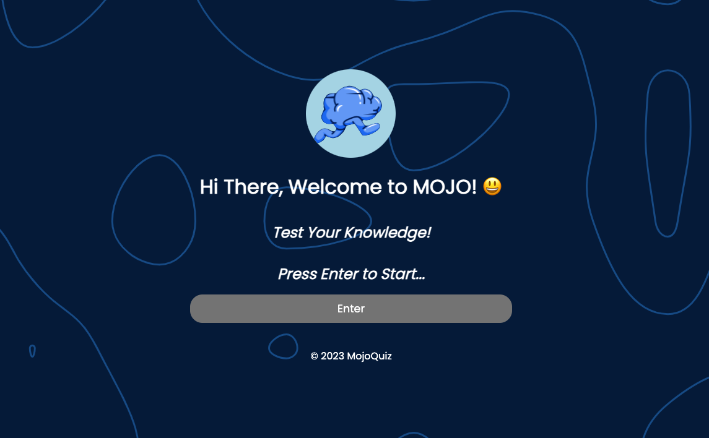
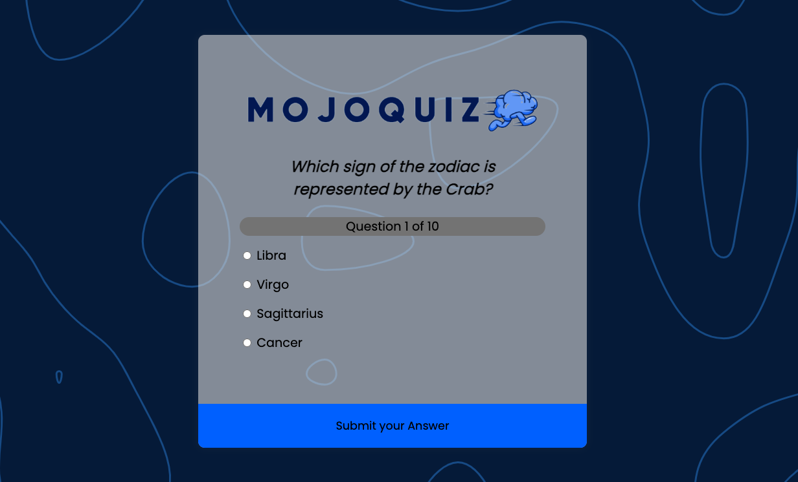
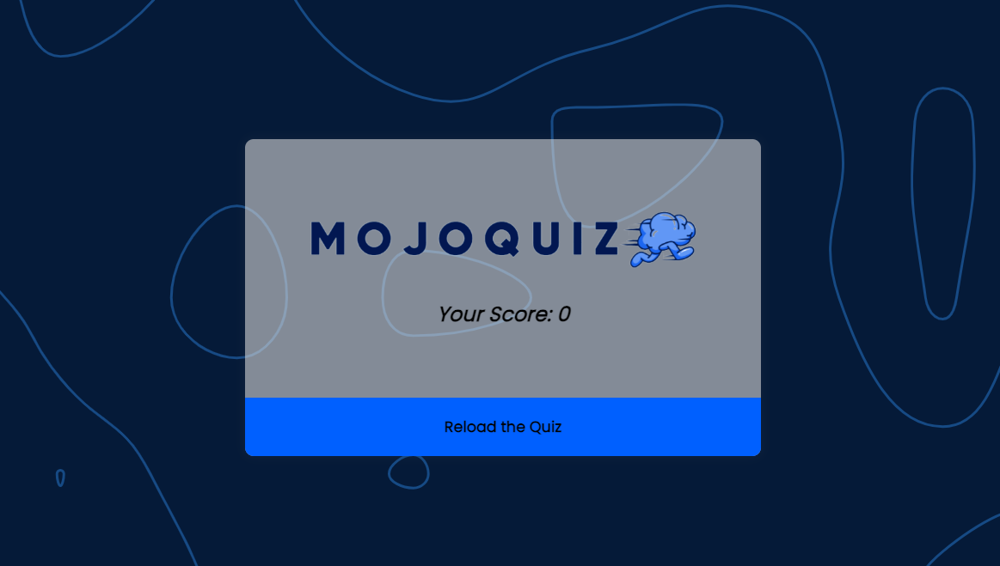

This is my README file! Welcome to MojoQuiz!

# Quiz Program - MojoQuiz

Author: Edgar Otieno

## Description

MojoQuiz is a fun and interactive quiz program that tests your knowledge on various topics. It offers a wide range of questions and challenges, making it an entertaining way to learn and have fun. This program uses a public API to fetch trivia questions.

## MojoQuiz App MVP

1. MojoQuiz will use a public API called Open Trivia, which is a popular API and offers wide range of trivia questions.
2. It displays diverse questions and answer choice to the user and allows them to select their preferred answers.
3. At the end, MojoQuiz will provide feedback on how many questions were answered correctly out of the number of questions ,     displaying the score at the end of the quiz.
4. It has basic styling and a user-friendly interface.
5. MojoQuiz also has the option of retrying the quiz if at all the user is not satisfied with his/her results. This might also refresh the kind of questions displayed.

## Project Setup Instructions

Follow these instructions to set up the project on your local machine:

1. Clone the repository to your local machine:

   git clone https://github.com/edgarade98/phase-1-project-MojoQuiz

2.Navigate to the project directory:

cd phase-1-project-MojoQuiz

## Open the index.html file in your web browser to start the quiz:

open index.html

## Link to live site on GitHub Pages 

https://edgarade98.github.io/phase-1-project-MojoQuiz/

## Screenshots of MojoQuiz

Here are some screenshots of the MojoQuiz application in action:

## Copyright and License

© 2023 MojoQuiz

